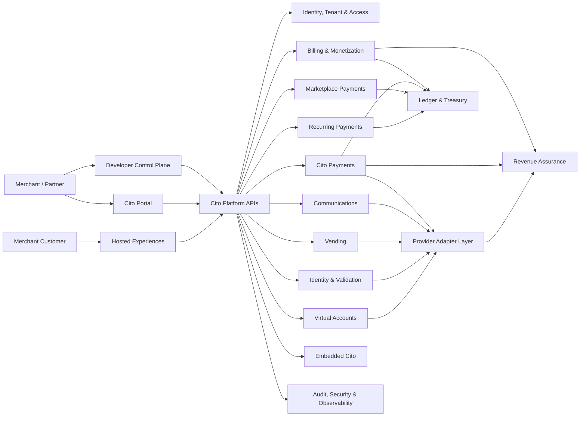
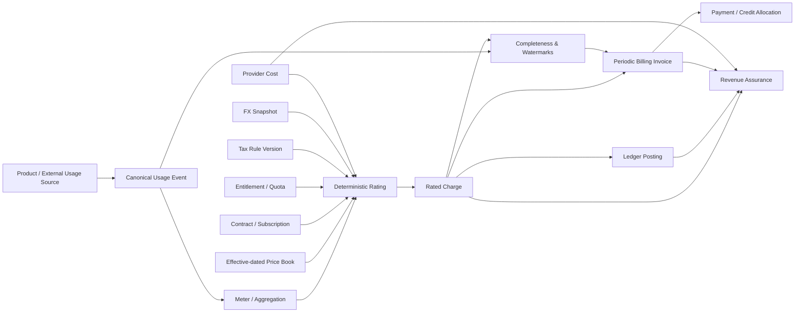

# Cito Platform Architecture

Cito is the platform. **Cito Payments** is one product domain within it. The legacy name **CPay** is retained only where compatibility requires an existing API, database identifier, deployment artifact, or integration contract to remain stable.

This document is the platform-first architecture entry point. It replaces the assumption that every capability is an extension of a payment gateway.

## 1. Platform context



## 2. Architectural layers

### 2.1 Core platform services

These services are shared and must not depend on a particular product module:

- tenant/organization identity and isolation;
- authentication, authorization, scopes, roles and access review;
- immutable audit evidence;
- developer projects, service accounts and credentials;
- event/outbox infrastructure;
- universal billing/metering/rating;
- double-entry ledger and treasury controls;
- reconciliation/revenue assurance;
- observability and operating controls.

### 2.2 Product domains

Product domains consume the shared platform and publish normalized facts back to it:

- Cito Payments;
- Communications;
- Vending;
- Identity & Validation;
- Marketplace Payments;
- Recurring Payments;
- Virtual Accounts;
- Merchant Intelligence;
- Embedded Cito;
- Integrations Marketplace.

A product domain may own its workflow and provider semantics, but it must not own a duplicate ledger, tenant model, billing engine, audit subsystem, or developer-credential system.

### 2.3 Provider adapter layer

Provider-specific APIs, credentials, signatures, status vocabularies, retries, statement formats and cost mappings stay outside the financial core. Adapters emit normalized product facts and normalized provider-cost facts. Adapter certification is behavioural and must cover timeout, ambiguity, duplicate callback, reconciliation and reversal paths.

## 3. Billing and monetization domain



### Billing invariants

1. A usage fact is immutable; corrections are additional events.
2. A rated charge is reproducible from retained event data and exact rule versions.
3. Provider cost and customer price are independent commercial facts.
4. Monetary effects use append-only balanced accounting; correction uses reversal/compensation.
5. Invoice finalization fails closed until completeness passes or an authorized waiver is recorded.
6. A tenant context is mandatory for all tenant-owned data-plane work.
7. Replay/idempotency cannot create duplicate usage, charges, reservations or postings.
8. Protected financial actions require authorized human approval; AI remains advisory.

## 4. BaaS control plane and data plane

### Control plane

The Billing-as-a-Service control plane owns:

- tenant activation and legal/commercial/tax/funds-flow readiness;
- developer projects, service accounts and scopes;
- customers and billing accounts;
- service/meter catalog configuration;
- contracts and subscriptions;
- entitlements and quotas;
- price-book governance;
- API quotas and webhook subscriptions;
- protected actions and approvals;
- sandbox-to-production lifecycle.

### Data plane

The BaaS data plane owns low-latency and high-volume execution:

- usage ingestion;
- online authorization/reservation/commit/release/reversal;
- metering and rating;
- event/outbox processing;
- billing-run execution;
- exports and webhook delivery.

Control-plane authorization decisions are explicit inputs to data-plane execution. The data plane must never infer production eligibility merely because a database row exists.

## 5. Revenue assurance

Revenue assurance reconciles the full chain:

```text
source activity
  -> usage event
  -> meter result
  -> customer charge
  -> provider cost
  -> ledger
  -> invoice
  -> payment allocation
  -> provider statement
  -> settlement
```

Standard exception classes include missing usage, duplicate usage, unrated usage, uninvoiced charge, provider-cost mismatch, price mismatch, negative margin, tax/FX mismatch, ledger imbalance, unallocated payment and settlement mismatch.

## 6. Tenant isolation boundary

Tenant isolation applies to:

- API authentication and request context;
- repository queries and updates;
- scheduled/background jobs;
- outbox handlers;
- cache keys;
- object/file exports;
- webhook delivery;
- ledger links and reporting;
- metrics labels where tenant identity is permitted;
- support/impersonation workflows.

No service may accept a tenant identifier supplied by an untrusted caller as proof of authorization. The authenticated context selects the tenant and repositories enforce it again.

## 7. API architecture

New platform APIs use the **Cito** name. Existing CPay endpoints remain compatibility contracts until formally deprecated.

- `/api/v2/native/payments/...` remains compatible for payment integrations.
- `/api/v2/native/billing/baas/...` is the current BaaS execution surface.
- new public billing contracts are documented under `Docs/Api/cito-billing-baas-v2-openapi.yaml`.

Every public operation must have:

- an OpenAPI operation ID;
- authentication/security definition;
- tenant/environment semantics;
- idempotency policy where state changes;
- stable error contract;
- request/response examples;
- behavioural contract test.

## 8. Financial integrity

The ledger is shared across products. Product modules provide accounting intent; the ledger owns posting integrity. Required invariants include:

- debit = credit per posting group and currency;
- finalized entries are immutable;
- reversals reference original postings;
- closed periods reject unauthorized posting;
- reservation/commit/release cannot overspend;
- invoice outstanding balance equals finalized charge less valid credits and allocations;
- treasury movement requires journal evidence;
- cross-tenant financial references fail closed.

## 9. Compatibility strategy

Legacy `CPay` identifiers are classified as one of:

1. **Public compatibility contract**: retain until a published deprecation window ends.
2. **Persisted identifier/schema**: retain unless migration value clearly exceeds risk.
3. **Internal implementation name**: rename gradually when no external dependency exists.
4. **Documentation/brand text**: use Cito immediately unless describing a legacy contract.

See `Docs/Compatibility/CPay-to-Cito-compatibility.md`.

## 10. Acceptance authority

The frozen platform requirements are `CITO-BILL-001` through `CITO-BILL-042` in `Docs/Requirements/Cito-42-requirements-traceability.md`. Release decisions use executable evidence and production evidence, not feature claims in a README.
