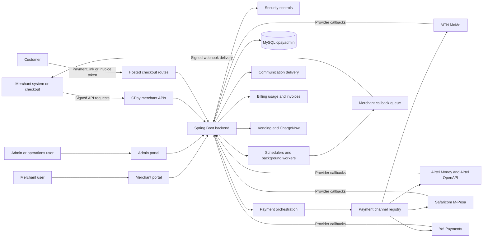
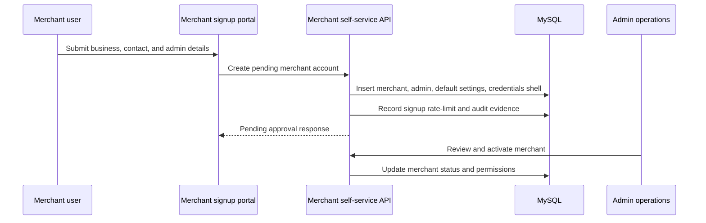
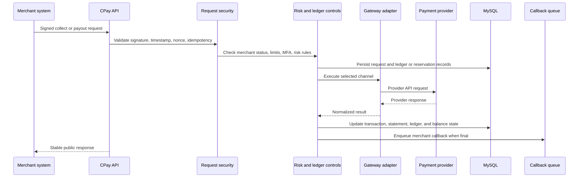
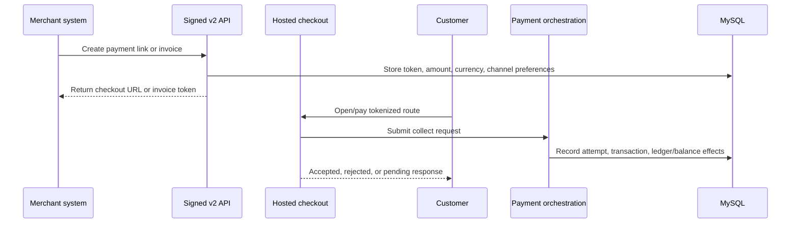
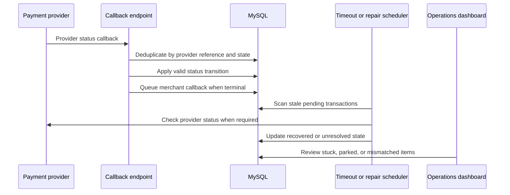
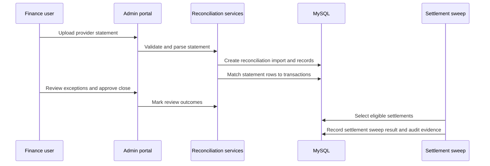

# CPay Architecture Overview

This document is the high-level architecture entry point for CPay. It connects the backend README,
the existing review-derived roadmap documents, and the current code layout into one navigable view of
the system.

Use it to understand the main runtime components, money-movement flows, callback and reconciliation
flows, and the core data relationships that support the admin and merchant portals.

## System Context



## Runtime Components

| Area | Main paths | Responsibility |
|---|---|---|
| Admin portal | `Clientside/src/components/modules` | Admin dashboard, merchants, settings, transactions, audit trail, and operations surfaces. |
| Merchant portal | `Clientside/src/components/modules/merchant` | Merchant dashboard, payment channels, payments, SMS, webhooks, vending, settings, and account management. |
| Public API | `InitializrSpringbootProjectFresh/src/main/java/net/citotech/cito/api/v2` and legacy controllers | Merchant-facing collect, payout, status, balance, signing, idempotency, and compatibility routes. |
| Hosted checkout | `checkout` | Payment links, invoices/request-to-pay, tokenized customer payment routes, and checkout attempts. |
| Payment orchestration | `PaymentOrchestrationService`, `api/v2`, `gateway` | Validates requests, applies risk controls, selects channels, calls providers, and records transaction state. |
| Gateway adapters | `gateway/*Adapter.java` | Provider-specific request building, response parsing, token use, endpoint execution, and capability metadata. |
| Callback delivery | `callback`, `scheduler/CallbackRetryScheduler.java` | Queues, signs, retries, parks, and audits merchant webhook deliveries. |
| Reconciliation and settlement | `reconciliation` | Statement import, matching, review queues, finance close, and settlement sweep foundations. |
| Ledger and balances | `ledger`, `balance`, `money` | Double-entry ledger foundations, balance read models, currency-safe amounts, and trial-balance checks. |
| Security and risk | `security`, `compliance`, `config/SecurityConfig.java` | Sessions, CSRF, MFA, rate limits, signatures, nonce replay protection, risk rules, KYC, and screening. |
| Operations | `admin`, `metrics`, `scheduler` | Readiness dashboard, operating controls, scheduled jobs, audit evidence, health, and observability. |
| Communication | `communication` | SMS/email delivery, provider routing, templates, preferences, campaigns, delivery logs, credentials, policies, and billing metering. |
| Billing | `billing` | Billing tenants, usage events, outbox relay, price books, rated charges, invoices, completeness gates, and ledger trace links. |
| Vending | `vending` | Merchant-hosted vending locations, pricing, devices, rentals, ChargeNow/OEM connector setup, and signed device callbacks. |
| Schema | `src/main/resources/db/migration`, `Docs/Schema` | Flyway migrations, current schema snapshots, and schema operating rules. |

## Package Boundaries

The current backend keeps legacy APIs working while moving new code toward typed service boundaries:

```text
net.citotech.cito
  api/v2/          Versioned merchant API, DTOs, signing, idempotency, and native payment routes
  gateway/         Payment channel adapter contract and provider-specific adapters
  callback/        Merchant webhook queue, signing, claims, delivery log, and replay
  reconciliation/  Statement parsers, matching, review queues, finance close, settlement sweeps
  ledger/          Double-entry ledger accounts, entries, posting, balances, trial balance
  balance/         Channel balance read models and normalized balance APIs
  merchant/        Merchant self-service signup, environment selection, channel credentials
  checkout/        Payment links, hosted checkout, invoices, tokenized customer payment routes
  compliance/      KYC, sanctions screening, risk decisions, and compliance case evidence
  communication/   SMS/email routing, templates, preferences, campaigns, delivery logs, metering
  billing/         Usage events, price books, rated charges, periodic invoices, ledger traceability
  vending/         Vending locations, devices, rentals, ChargeNow/OEM connectors and callbacks
  security/        CSRF, signatures, MFA, password reset tokens, nonce store, rate limits
  admin/           Admin permissions, readiness, audit, operating controls, feature flags
  scheduler/       Retry, timeout, cleanup, ledger, float alert, webhook, and settlement jobs
```

New money-moving code should enter through `api/v2`, `PaymentOrchestrationService`, and the gateway
adapter contract. Avoid adding new provider-specific behavior to `Common.doPayIn`, `Common.doPayOut`,
or monolithic controller methods unless it is a compatibility shim.

## Flow 1: Merchant Onboarding



Key tables: `merchants`, `merchant_admins`, `merchant_admin_privileges`, `merchant_settings`,
`merchant_channel_credentials`, `merchant_environment_preferences`, `admin_audit_events`.

Related docs:

- `Docs/Merchant-self-service.md`
- `Docs/Security-authentication-roadmap.md`
- `Docs/Compliance-risk-controls.md`

## Flow 2: Collection or Payout



The current implementation supports both legacy compatibility and the v2 adapter path. New channel
work should prefer the adapter path and keep merchant-facing responses mapped through the public error
catalog.

Related docs:

- `Docs/Api-v2-signing.md`
- `Docs/Gateway-adapter-guide.md`
- `Docs/Error-catalog.md`
- `Docs/Money-ledger-and-orchestration-roadmap.md`
- `Docs/Process-flow-controls.md`

## Flow 2A: Payment Link or Invoice Checkout



Creation routes are signed merchant API calls. Public checkout routes are tokenized customer routes
and must still use the same provider, risk, idempotency, and status controls as direct API payments.

## Flow 3: Provider Callback and Status Repair



Provider callbacks and scheduled status checks should never create duplicate money movement. The
transaction row, ledger group, and callback queue must agree before an item is considered complete.

Related docs:

- `Docs/Webhook-events.md`
- `Docs/Runbooks/Callback-security-and-requeue.md`
- `Docs/Runbooks/Operations-alerts.md`
- `Docs/Reliability-scale-runbook.md`

## Flow 4: Reconciliation and Settlement



Reconciliation is intentionally separate from provider execution. Statement rows can identify
mismatches and proposed corrections, but should not silently mutate ledger entries without an
auditable review step.

Related docs:

- `Docs/Runbooks/Reconciliation-finance-daily-close.md`
- `Docs/Runbooks/Provider-sandbox-and-statement-validation.md`
- `Docs/Compliance-risk-controls.md`

## Core Data Relationships

```mermaid
erDiagram
    MERCHANTS ||--o{ MERCHANT_ADMINS : owns
    MERCHANTS ||--o{ MERCHANT_SETTINGS : configures
    MERCHANTS ||--o{ MERCHANT_CHANNEL_CREDENTIALS : configures
    MERCHANTS ||--o{ MERCHANT_ENVIRONMENT_PREFERENCES : selects
    MERCHANTS ||--o{ MERCHANT_WEBHOOK_ENDPOINTS : receives
    MERCHANTS ||--o{ MERCHANT_TRANSACTIONS_LOG : submits
    MERCHANTS ||--o{ MERCHANT_BATCH_TRANSACTIONS_LOG : submits
    MERCHANT_BATCH_TRANSACTIONS_LOG ||--o{ BENEFICIARIES : contains
    MERCHANT_TRANSACTIONS_LOG ||--o{ MERCHANT_STATEMENT : posts
    MERCHANT_TRANSACTIONS_LOG ||--o{ CALLBACK_TASKS : notifies
    MERCHANT_TRANSACTIONS_LOG ||--o{ PAYOUT_COMPENSATION_SAGAS : compensates
    MERCHANT_TRANSACTIONS_LOG ||--o{ LEDGER_TRANSACTIONS : records
    LEDGER_TRANSACTIONS ||--o{ LEDGER_ENTRIES : contains
    LEDGER_ACCOUNTS ||--o{ LEDGER_ENTRIES : receives
    LEDGER_ACCOUNTS ||--o{ LEDGER_ACCOUNT_BALANCES : summarizes
    MERCHANTS ||--o{ MERCHANT_CHANNEL_BALANCES : summarizes
    RECONCILIATION_IMPORTS ||--o{ RECONCILIATION_RECORDS : parses
    RECONCILIATION_RECORDS ||--o{ RECONCILIATION_REVIEWS : reviews
    COMPLIANCE_PROFILES ||--o{ COMPLIANCE_CASES : opens
    COMPLIANCE_CASES ||--o{ COMPLIANCE_CASE_NOTES : records
    RISK_DECISIONS ||--o{ RISK_DECISION_SCORES : explains
    PAYMENT_LINKS ||--o{ HOSTED_CHECKOUT_ATTEMPTS : attempts
    INVOICES ||--o{ INVOICE_ATTEMPTS : attempts
    MERCHANT_WEBHOOK_ENDPOINTS ||--o{ MERCHANT_WEBHOOK_DELIVERIES : logs
    BILLING_TENANTS ||--o{ BILLING_USAGE_EVENTS : records
    BILLING_TENANTS ||--o{ BILLING_INVOICES : bills
    COMMUNICATION_CAMPAIGNS ||--o{ COMMUNICATION_CAMPAIGN_ITEMS : contains
    COMMUNICATION_MESSAGE_DELIVERIES ||--o{ BILLING_USAGE_EVENTS : meters
    VENDING_LOCATIONS ||--o{ VENDING_DEVICES : hosts
    VENDING_DEVICES ||--o{ VENDING_RENTALS : serves
```



The ERD above shows the target/current hybrid model. Some legacy paths still write
`merchant_transactions_log`, `merchant_statement`, and hardcoded balance columns, while newer controls
add normalized ledger, balance, payment-link, webhook, risk, compliance, and environment tables.

## Storage and Migration Rules

- Flyway migrations under `InitializrSpringbootProjectFresh/src/main/resources/db/migration` are the
  canonical schema source.
- `Docs/Schema/Readme.md` is the schema operating guide and snapshot index.
- New schema changes should be additive, idempotent, and paired with a focused test or contract check.
- Money values should use `MoneyAmount`, `BigDecimal`, or minor-unit integer storage. Do not add new
  floating-point money calculations.
- New channel, balance, and currency data should be rows, not new hardcoded columns.
- Legacy compatibility rows may stay while v2 parity is proven, but new features should use the
  normalized model.

## Operational Contracts

| Contract | Rule |
|---|---|
| Idempotency | Money-moving requests must be safe for merchant retries and provider retries. |
| Replay protection | Signed requests must include timestamp and nonce checks, backed by JDBC or another shared store in clustered environments. |
| Status transitions | Payment state changes must reject regressions and impossible transitions. |
| Ledger integrity | Ledger posting groups must balance by account and currency. |
| Callback delivery | Merchant callbacks are queued, signed, retried, parked when exhausted, and visible to operations. |
| Provider credentials | Merchant and provider credentials are encrypted or stored in a controlled token store, not plain files. |
| Sandbox vs production | Environment selection is explicit per merchant/user, with production limits enforced by configuration. |
| Observability | Request IDs, structured logs, metrics, and operations dashboards must make failed or parked work visible. |

## Related Documents

- `InitializrSpringbootProjectFresh/Readme.md`
- `Docs/Architecture-v2-implementation.md`
- `Docs/Gateway-adapter-guide.md`
- `Docs/Payment-channel-schema.md`
- `Docs/Schema/Readme.md`
- `Docs/Money-ledger-and-orchestration-roadmap.md`
- `Docs/Process-flow-controls.md`
- `Docs/Provider-integration-roadmap.md`
- `Docs/Security-authentication-roadmap.md`
- `Docs/Compliance-risk-controls.md`
- `Docs/Observability.md`
- `Docs/Reliability-scale-runbook.md`
